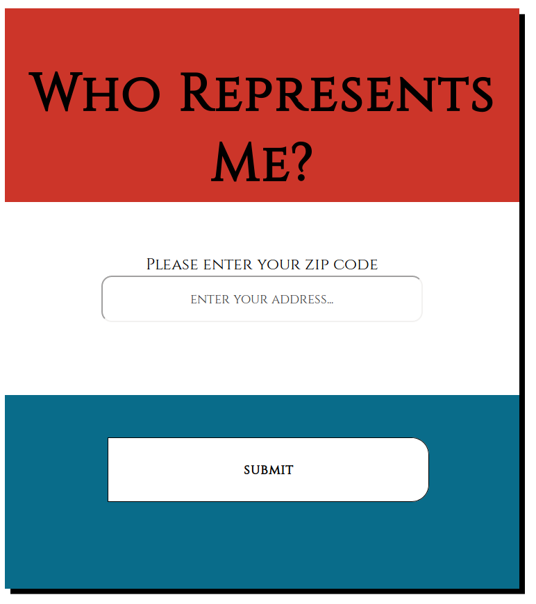

# RepMe

A web app for finding who your representitives are by your home address.

## Motivation

For democracy to be affective, the people (YOU!) need to have easy access to their representitives.

## Build Status

## Screen Shots

Landing page:

Government Level Selection:

Representitive Selection:

Representitive Card:

## Built With:

* HTML
* CSS
* JS
* JQuery

## Features:

* Find all elected officials you are able to vote for
* Get their pictures, phone numbers, and FaceBooks if provided by API

## Live:

- [Live](https://omegacoo.github.io/repme/)

## Author:

* **Ben Sumser**
